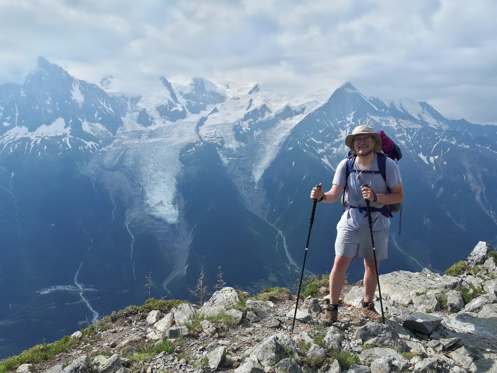

# About Me

Hello everyone!

I'm Aaron Uurman, a software developer living and working in Estonia.

I got started in software development rather late,
after the second semester at university.
From that on I have never thought about doing something else,
I enjoy life as a developer. 
I have been a software developer on Microsoft stack for more than 4 years and I like it.
In my free time, I enjoy playing disc-golf, running or hiking.

The picture above is taken in Tour du Mont Blanc.

This blog purpose is to share knowledge and experience 
I came across in my career by providing some tutorials and know-how via blog posts.
If you find that something can be done better or 
this content is useful then please don't hesitate to let me know, 
I would like to hear your opinion.

