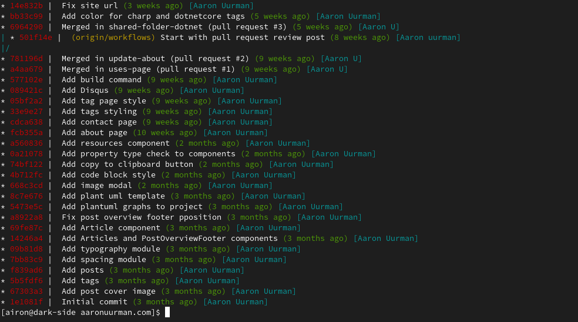

# Git

## Formatted logging

```bash
git log --pretty='%Cred%h%Creset | %C(yellow)%d%Creset %s %Cgreen(%cr)%Creset %C(cyan)[%an]%Creset' --graph --all
```

Will output beautifly formatted git log.
Since it's a quite long command it would make sense to make a alias for that.



## Navigate to project root directory

```bash
cd `git rev-parse --show-toplevel`
```

Defined alias _cg_ for that.
