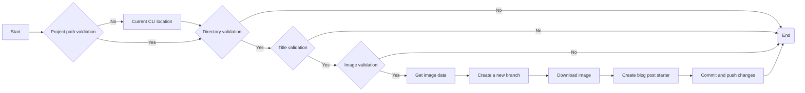

In a previous post, I added an image option to blog command, did some refactoring and
added some unit tests. I this post I'm going to do some more refactoring, to come up with a better project structure, add additional tasks and try to get it all together so that I could start adding more commands. <br />
Probably this will be my last post about this tool, from now on I will extend it if I have some task that can be automated.

### Overview
The current version of assistant contains quite a lot of structural changes, I moved files from one place to another, refactored a lot of code and added additional tests, all for a better future.<br />
Blog command got a git task - now if I run the command it also creates a separate branch and makes an initial commit to it with starter file and image included. So that I can easily just jump into my Visual Studio and start writing a new blog post. This same post is also made using an assistant blog command, cool right?<br />

This is a current flow of a blog command:


When runnind tool on command line it gives now a really good overview what tasks are running and how many left.

After running this command I can see new branch:<br />


And I can see a initial commit for a new post:<br />


### Project structure

```bash
assistant/
├── README.md
├── assistant
│  ├── __init__.py
│  ├── app.py
│  ├── commands
│  │  ├── __init__.py
│  │  └── blog
│  │  ├── __init__.py
│  │  ├── blog_command.py
│  │  ├── dto
│  │  │  └── image_dto.py
│  │  └── tasks
│  │  ├── __init__.py
│  │  ├── commit_push_changes.py
│  │  ├── create_new_branch.py
│  │  ├── create_starter_file.py
│  │  ├── download_img.py
│  │  ├── reguest_img_data.py
│  │  ├── validate_image.py
│  │  ├── validate_project_path.py
│  │  └── validate_title.py
│  ├── common
│  │  ├── file_handler.py
│  │  ├── logger.py
│  │  └── str_helper.py
│  └── dto
│  ├── __init__.py
│  └── config_dto.py
├── install-dev.sh
├── setup.py
└── tests
 ├── commands
 │  └── blog
 │  └── tasks
 │  ├── __init__.py
 │  ├── test_create_new_branch.py
 │  ├── test_create_starter_file.py
 │  ├── test_download_img.py
 │  ├── test_request_img_data.py
 │  ├── test_validate_image.py
 │  ├── test_validate_project_path.py
 │  └── test_validate_title.py
 └── common
 ├── __init__.py
 └── test_str_helper.py
```
Each command will now be separated into their folder and each command will have entry file (for example blog_command.py), data transfer object and tasks.<br />
I'm just going to point out here changes made in blog command, rest is the same and can be found in GitHub (link under resources).

#### blog_command.py
```python
from assistant.common import logger
from assistant.commands.blog.tasks.download_img import DownloadImg
from assistant.commands.blog.tasks.validate_image import ValidateImage
from assistant.commands.blog.tasks.validate_title import ValidateTitle
from assistant.commands.blog.tasks.reguest_img_data import RequestImageData
from assistant.commands.blog.tasks.create_new_branch import CreateNewBranch
from assistant.commands.blog.tasks.create_starter_file import CreateStarterFile
from assistant.commands.blog.tasks.commit_push_changes import CommitPushChanges
from assistant.commands.blog.tasks.validate_project_path import ValidateProjectPath

def handle(config, title, img_url, project_path):
	try:
		image = {}
		tasks = [
		ValidateProjectPath(project_path),
		ValidateTitle(title),
		ValidateImage(img_url),
		RequestImageData(img_url, title, config),
		CreateNewBranch(title, project_path),
		DownloadImg(project_path, img_url, title),
		CreateStarterFile(title, project_path),
		CommitPushChanges(project_path, title)
		]

		num_of_tasks = len(tasks)
		i = 1

		for task in tasks:
			logger.info(config.verbose, task.start_message)
			
			# RequestImageData returns multiple result and image object.
			# Image object is later used for creating a template.
			if (type(task).__name__ == 'RequestImageData'):
				result, image = task.execute()
			elif (type(task).__name__ == 'CreateStarterFile'):
				result = task.execute(image)
			else:
				result = task.execute()

			message = "[%i/%i] %s" % (i, num_of_tasks, result)
			logger.success(message)
			i+=1

	except ValueError as er:
		logger.error('Validation Error: {}'.format(er))
	except Exception as ex:
		logger.error(format(ex))

```
When comparing blog command with the previous postcode, then it's now more readable.
Each task is now a separate class and is registered to a task list. This helps me to count all processes and give numeric feedback to the user how many tasks are done and how many to go.<br />
Each task is then called using ```execute()``` method.

### Summary
In conclusion, this was a really fun and useful project. I learned quite a lot about Python and unit testing. I would that now the main structure for this tool is created it should be quite easy to add new commands. So now I need to just come up with an idea what to automate :)