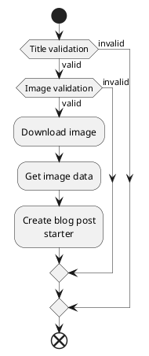

In the previous post, I started to create a CLI tool to automate some of my blog post workflow. I managed to set-up a new project and make a CLI tool to print "Hello World!".<br />
In this post I'm going to add the first command to the CLI tool, called "blog" and this will require an argument called "title". I will also add validation for this command argument and take a look at unit testing.

### Overview

In general, the whole business logic of the application will look like in the following schema.

<Modal>



</Modal>

To start an application user will have to type on the command line following command:

```bash
assistant blog "Title of the blog" "https://unsplash.com/photos/9FvZfRKKfH8"
```

This will trigger blog command validation and code will now validate the title. Probably there will be that title is required and should have some minimum length, so validation logic will look like that:<br />

- If the title is not valid it will throw exception and exit.
- If the title is valid, it will validate an Unsplash image URL.

Now, when validating an image URL, probably will need to check that string matches some URL pattern and contains a work "unsplash".
Image validation logic will look like that:<br />

- If the image URL not valid create a template and exit application.
- If the image URL is valid, download image, get image data, create a template and exit.

On a high level, I think that's all. I'm sure there will be some changes coming once I start to implement it, but at least this is a minimum requirement.<br/>
Since there is quite a lot to implement, I will stick to the plan explained in an introduction of this blog post.

### Project structure

```bash
assistant/
|-- README.md
|-- assistant.py
|-- install-dev.sh
|-- logger.py
|-- setup.py
|-- str_helper.py
|-- test_str_helper.py
|-- test_validator.py
|-- validator.py
```

#### assistant.py

In a previous post I defined that calling cli() method will print "Hello World!", in this post, I have defined a verbose option, "blog" command and "title" attribute that can be passed in.<br />
At the beginning of the file I'm importing a modules click, logger and validator - logger and validator are modules I created for a better code structure.

```python
import click
import logger
import validator
```

Then I defined a Config object that will be used for options transfer between commands, one of the options is a verbose flag.
Using click.make_pass_decorator() the command I create a callback that will return this object and make sure it's initialized.

```python
class Config(object):

	def __init__(self):
		self.verbose = False

pass_config = click.make_pass_decorator(Config, ensure=True)
```

Program entrypoint will still be cli() function. I assign a verbose option for this command and in this command, I Initialize options values to config objects.<br />
Using click.group() function I can define that this command can have subcommands, in my case it's a "blog" command.

```python
@click.group()
@click.option(
	'-v',
	'--verbose',
	is_flag=True,
	help='Will print verbose messages about processes.'
)
@pass_config
def cli(config, verbose):
	config.verbose = verbose
```

And now I defined a subcommand "blog", for this, I use command() method. Subcommand method needs to be chained to a parent command - like this cli.command().<br />
This command will take the title as an argument. To define an argument for the command I use click.argument() method.<br />
And in "blog" command, I added a description of the command, do validation for a "title" argument and write a result to the command line. In the future, this command will do more things, but for now, it's fine.

```python
@cli.command()
@click.argument('title')
@pass_config
def blog(config, title):
	"""Use this command to interact with blog."""
	try:
		logger.info(config.verbose, 'Starting title validation.')
		title_validation_result = validator.validate_tile(title)
		logger.success(title_validation_result)
	except ValueError as er:
		logger.error('Validation Error: {}'.format(er))
	except Exception as ex:
		logger.error(format(ex))
```

And finally I had to register a "blog" command as a sub command of cli.
This can be done like this:

```python
cli.add_command(blog)
```

#### logger.py

This module is a wrapper around click.echo() method. All it does is just give me a cleaner way to output error, success, and info to a command line.

```python
from click import echo, style

def info(isVerbose, text):
	"""Log information to the command line if verbose is enabled."""
	if isVerbose:
		echo(text)

def error(text):
	"""Log error message to the command line."""
	echo(style(text, fg='red'))

def success(text):
	"""Log success message to command line."""
	echo(style(text, fg='green'))
```

#### str_helper.py

This module will contain a string related helper functions. Currently, I have defined only one function that checks if a string is null or whitespace. I'm using this function for validation.

```python
def is_null_or_whitespace(str):
	"""Check if string is null or whitespace."""
	if str and str.strip():
		return False
	else:
		return True
```

#### validator.py

This module will contain all the validation functions. Currently, I have defined only title validation. I'm making sure that the provided title argument is not null and is at least 3 characters long. If it's not valid it will throw ValueError, it's a part of click API.

```python
from str_helper import is_null_or_whitespace

def validate_tile(title):
	"""Validate blog title.
	- required
	- at least 3 characters
	returns:
		Validation success message.
	"""
	if is_null_or_whitespace(title):
		raise ValueError('Blog title is required, min-lenght 3 characters.')

	if (len(title) < 3):
		raise ValueError('Blog title must be at least 3 characters.')

	return 'Validation Success: Title "%s" is valid.' % title
```

### Unit testing

For testing I'm using python unit testing framework called <a href="https://docs.python.org/3/library/unittest.html#" target='blank'>unittest</a>.
I have covered two modules with unit tests, str_helper, and validator.
I'm following the AAA (Arrange, Act, Assert) pattern, it's a common way of writing unit tests.

    - The Arrange section of a unit test method initializes objects and sets the value of the data that is passed to the method under test.

    - The Act section invokes the method under test with the arranged parameters.

    - The Assert section verifies that the action of the method under test behaves as expected.

```python
def test_empty_string_is_null_or_whitespace_true(self):
	#Arrange
	text = ''
	#Act
	result = str_helper.is_null_or_whitespace(text)
	#Assert
	self.assertTrue(result)
```

### Summary

In this post I created a subcommand for the CLI tool called "blog", this command takes in an argument called "title" and I added basic validation for argument. Based on validation application print to command line an error or success.<br />
I also covered this logic with a unit tests that I'm running from my editor.<br />
In the next post I'm going to implement a new argument to a "blog" command called image and add image download logic.<br />
Like always, the source code of this post is available in <a href="https://github.com/aaronuurman/assistant" target='blank'>Github</a>.
