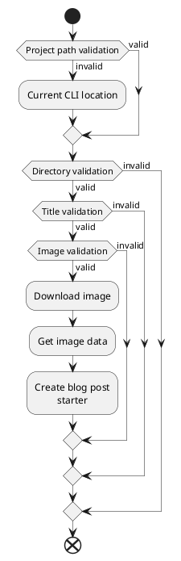

In the previous post, I created the first command for an assistant called blog and added an argument title to it. Title argument is validated and
most of the business logic is covered with unit tests.<br />
In this post, I'm going to create a new argument called image and validate it. The business logic will be covered with unit tests.<br />
The second plan is to do a bit of refactoring and make a CLI tool more user-friendly by switching from arguments to options.

### Overview
When I started to implement a image option logic I relized that I need to make changes in busines logic and add a project folder option also with a validation. So after this change the whole logic will look as following:

<Modal>



</Modal>

To start an application user will have to type on the command line following command:
```bash
assistant blog --title "Title of the blog" --image "https://unsplash.com/photos/9FvZfRKKfH8"
```
<Modal>


</Modal>

As seen on the gif above, the project starts to look like a real tool.
The main change is that now application uses click option's - in my opinion, this makes interaction with a tool more human-readable.<br />

### Project structure
In structure I have made some minor changes - for better readability, I moved blog command logic into a separate module. I introduced new modules called file_handler and web_scraper. 

```bash
assistant/
|-- README.md
|-- assistant.py
|-- blog-command.py
|-- file-handler.py
|-- install-dev.sh
|-- logger.py
|-- setup.py
|-- str_helper.py
|-- test_str_helper.py
|-- test_validator.py
|-- test_web_scraper.py
|-- validator.py
|-- web_scraper.py
```

#### assistant.py
In a previous post, I implemented a blog command and title argument. At this point passing title using click argument seemed fine but when I added an image argument I realized the interaction with an application did not feel right. So I decided to change it and start using click options.<br />
Here is an example of command before the change:
```bash
assistant blog "Title of the blog" "https://unsplash.com/photos/9FvZfRKKfH8"
```
And this is after:
```bash
assistant blog --title "Title of the blog" --image "https://unsplash.com/photos/9FvZfRKKfH8"
```
The same command can be written in a short version:
```bash
assistant blog -t "Title of the blog" -i "https://unsplash.com/photos/9FvZfRKKfH8"
```
So let's check what has changed in an assistant.py file.<br />
On project import lever there are some changes. I have moved a logger and validation module import under the blog_command module and now import this instead. Also, I need a str_helper, to check if a user has passed a project path or not.

```python
import click
import os
import blog_command
from str_helper import is_null_or_whitespace
```

Program entrypoint is still cli() function, no changes made here.

```python
@click.group()
@click.option(
 '-v',
 '--verbose',
 is_flag=True,
 help='Will print verbose messages about processes.'
)
@pass_config
def cli(config, verbose):
 config.verbose = verbose
```

Blog command business logic is now moved under a blog_command module.
But another thing to notice is that I have created two additional parameters - image and project-path.<br />
The project-path is optional, but if not provided a current CLI location is used. For that, I have imported an os module and use the getcwd() method.

```python
@cli.command()
@click.option(
 '-t',
 '--title',
 required=True,
 type=str,
 help='The title of blog post.'
)
@click.option(
 '-i',
 '--image',
 required=True,
 type=str,
 help='The Unsplash image url.'
)
@click.option(
 '-p',
 '--project-path',
 required=False,
 type=click.Path(),
 help='The full path to project folder. Default: current working directory.',
 default=os.getcwd()
)
@pass_config
def blog(config, title, image, project_path):
 """Use this command to start a new blog post."""
 blog_command.handle(config, title, image, project_path)
```

#### blog_command.py

As visible below, the blog command is getting quite heavy, mainly it's because I have defined some
additional information logging. The main idea in this command is to make a validation first and then get image data and download an image. Right now what annoys me is that the user does not have feedback on how much of an image is downloaded. For now, it's fine, but I will come up with something later when the "happy path" is implemented.

```python
from slugify import slugify
from os import path
import logger
import validator
import web_scraper
import file_handler

def handle(config, title, img_url, project_path):
 try:
 logger.info(config.verbose, 'Starting project path validation.')
 path_validation_result = validator.validate_project_path(project_path)
 logger.success(path_validation_result)

 logger.info(config.verbose, 'Starting title validation.')
 title_validation_result = validator.validate_tile(title)
 logger.success(title_validation_result)

 logger.info(config.verbose, 'Starting image url validation.')
 img_validation_result = validator.validate_img(img_url)
 logger.success(img_validation_result)

 logger.info(config.verbose, 'Requesting image data.')
 file_name = '.'.join((slugify(title),'jpg'))
 image = web_scraper.get_image_author(img_url, file_name)
 logger.info(config.verbose, 'Image url: %s' % image.url)
 logger.info(config.verbose, 'Image file name: %s' % image.file_name)
 logger.info(config.verbose, 'Image author: %s' % image.author_name)
 logger.info(config.verbose, 'Image author profile: %s' % image.author_profile)
 logger.success('Successfully aquired image data.')

 logger.info(config.verbose, 'Starting image download.')
 full_file_path = path.join(file_handler.find_sub_folder(project_path, '/src/images'), file_name)
 web_scraper.download_img(img_url, full_file_path)
 logger.success('Image "%s" downloaded succesfully to "%s".' % (img_url, full_file_path))

 except ValueError as er:
 logger.error('Validation Error: {}'.format(er))
 except Exception as ex:
 logger.error(format(ex))
```

#### file_handler.py

The file_handler module is something I added to a project. This will contain all the files, directory related logic.
For now, there will be only one search method, maybe later I will add something else.<br />
All this method does, is receiving a subdirectories of parent directory and then find a specific one.
This is needed because I have to make sure that the project folder contains an "images" folder. Since my blog project directory structure is nested, I decided that it's more comfortable to make it so that it's enough if the user is inside the project folder. Don't have to be navigated any other subdirectory.

```python
import os

def find_sub_folder(parent_path, sub_path):
 """Find a sub directory from parent folder.

 Returns:
 If the folder contains subdirectory then the full path to a subdirectory is returned.
 Else None is returned.
 """

 folders = []

 # r=root, d=directories, f = files
 for r, d, f in os.walk(parent_path):
 for folder in d:
 folders.append(os.path.join(r, folder))

 result = [x for x in folders if sub_path in x]

 if not result:
 return None

 return result[0]
```

#### validator.py
This module now got the update, I added two additional validation methods, one for image and the other for project-path.
The validate_img method is straight forward, basically, I had to make sure it's not empty if it is an exception is thrown. Then I had to make sure it's a valid URL - for this I used a regex. I did not want to add an Unsplash to regex, because maybe later there will be some other image provider or I will add images from some other place.
So to support only Unsplash images, for now, I added if check.
```python
def validate_img(img):
 """Validate blog image.
 - required
 - starts with https
 - is an Unsplash link

 returns:
 Validation success message.
 """
 if is_null_or_whitespace(img):
 raise ValueError('Blog image is required, currently supporting only Unsplash.')

 regex = re.compile(
 r'^(?:http|ftp)s?://' # http:// or https://
 r'(?:(?:[A-Z0-9](?:[A-Z0-9-]{0,61}[A-Z0-9])?\.)+(?:[A-Z]{2,6}\.?|[A-Z0-9-]{2,}\.?)|' #domain...
 r'\d{1,3}\.\d{1,3}\.\d{1,3}\.\d{1,3})' # ...or ip
 r'(?::\d+)?' # optional port
 r'(?:/?|[/?]\S+)$', re.IGNORECASE)

 result = re.match(regex, img)

 if result is None :
 raise ValueError('Invalid blog image url.')

 if "unsplash.com/photos/" not in img:
 raise ValueError('Invalid blog image url, currently supporting only Unsplash images.')

 return 'Validation Success: Image "%s" is valid.' % img
```
The validate_project_path method just makes sure that project-path parameter is not empty and project folder contains an "images" folder.
```python
def validate_project_path(path):
 """Validate project path.
 -required
 -should contain a 'images' folder

 returns:
 Validation success message.
 """

 if is_null_or_whitespace(path):
 raise ValueError('Path to blog project is required.')

 if not find_sub_folder(path, '/src/images'):
 raise ValueError('Blog project does not contain folder "images".')

 return 'Validation Success: Project path "%s" is valid.' % path
```

#### web_scraper.py

To download images and get image information for Unsplash I'm using a urllib and BeautifulSoup library.

```python
from urllib import request, parse
from bs4 import BeautifulSoup
```

I have defined an Image class, to keep image data in one place after receiving it.

```python
class Image:

 def __init__(self, file_name, url, author_name, author_profile):
 self.file_name = file_name
 self.url = url
 self.author_name = author_name
 self.author_profile = author_profile
```

In download_img method I just combine a URL and download image to a provided path.

```python
def download_img(imageUrl, filePath):
 """Download image from Unsplash and save it in provided location"""

 downloadEndPoint = imageUrl + '/download?force=true'
 request.urlretrieve(downloadEndPoint, filePath)
```
In get_image_author I have defined a selector class, then making request and storing response in variable to decode it and parse it using BeatifulSoup. The rest is just to select a correct data from response.

```python
def get_image_author(imageUrl, file_name):
 """Request image author data from page.
 
 Returns Image object with filled data.
 """

 selector = '_3XzpS _1ByhS _4kjHg _1O9Y0 _3l__V _1CBrG xLon9'
 response = request.urlopen(imageUrl)

 if response.code != 200:
 raise Exception('Failed to make request to "%s"' % imageUrl)

 data = response.read()
 html = data.decode('UTF-8')
 soup = BeautifulSoup(html, "html.parser")
 anchor = soup.find('a', class_=selector)
 username = anchor['href'].lstrip('/')
 author = anchor.contents[0]
 parsed_uri = parse.urlparse(imageUrl)
 author_profile = '{uri.scheme}://{uri.netloc}/'.format(uri=parsed_uri)
 image = Image(file_name, imageUrl, author, (author_profile + username))

 return image
```

### Summary
In this post, I created an additional two options/parameters to blog command - image and project-path. Created an image download logic and added more unit tests. <br />
In the next post, I'm going to create a blog post starter file and fill it with some initial data.<br />
Like always, the source code of this post is available in <a href="https://github.com/aaronuurman/assistant" target='blank'>Github</a>.