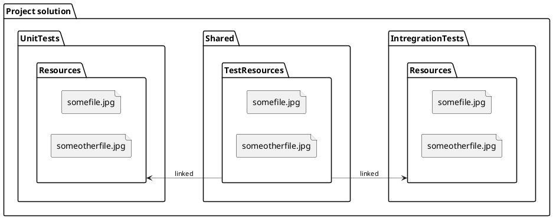

This post is about a small tip I discovered when I created a project with unit and integration tests.
In that project, I used some files to test a service functionality,
so I had to come up with a solution on how to share files between multiple projects.

## The need

This is a structure I'm trying to achieve in my current project.

<Modal>



</Modal>

## Solution

I ended up updating **.csproj** file directly by adding the following line.

```xml
<ItemGroup>
  <Content Include="..\Shared\TestResources\**\*" Link="Resources\%(RecursiveDir)%(Filename)%(Extension)" CopyToOutputDirectory="Always" />
</ItemGroup>
```

Here I'm using **Content** element to link files to project and publish them with the application.
All files in the shared folder are linked to the project **Resources** directory.

## Summary

File linking comes handy when there is a need to share content between multiple projects.
The result is much cleaner a well-structured project.
Also later when there is a need for file update then this can be done in a single place and all
linked content will also be updated.
